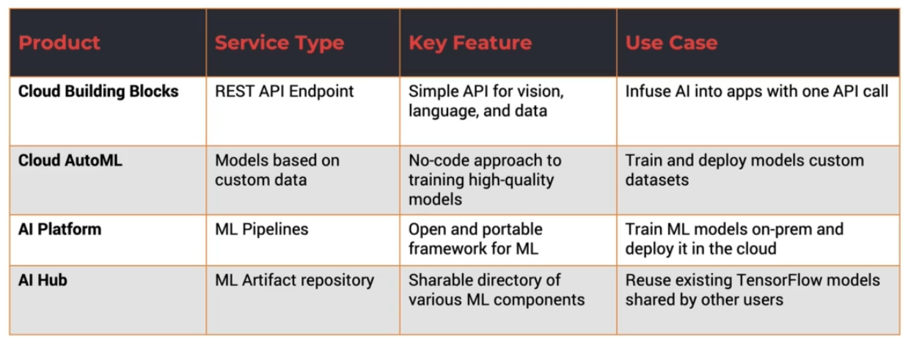

# AI & ML Services
[AI Building Blocks](<./AI Building Blocks.md>) provide AI through simple REST calls  
[[Cloud AutoML]] enables training models on custom datasets  
[[AI Platform]] provides end-to-end ML pipelines on-premises and cloud  
[[AI Hub]] is a Google hosted repository to discover, share, and deploy ML models. *It is a collection of artifacts and various resourses that can be shared*

