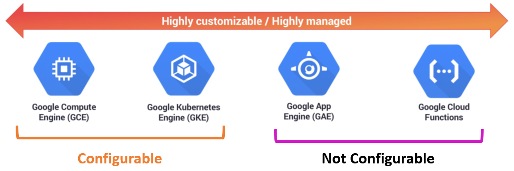

# Cloud Functions

**[[Serverless]]** execution environment.

It is fundamentally different from App Engine, Compute Engine, [[Kubernetes]] engine.

**Cloud functions** are written as functions with a well defined entrypoint and returning , deploying with no changes.

Tipically serverless compute environments **respond to events** via **triggers**. They run like a daemon

