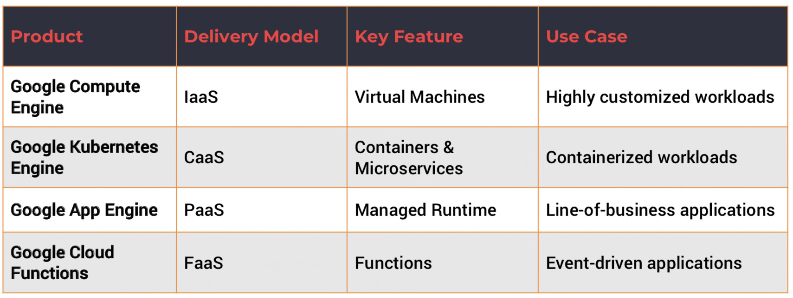

# Compute Services
Where code is **deployed** and **executed** 

- **Serverless environment**

Choices:
- [[App Engine]]: fully managed platform as a service (PaaS)
- [[Compute Engine]]: IaaS. Provides configurable VMs
- [[Kubernetes Engine]]: orchestration (containers)
- [[Cloud Functions]]: functions as a service (FaaS)

## Use cases
