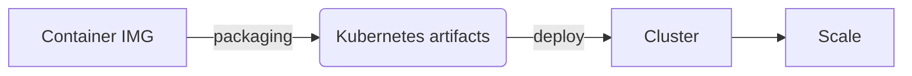

# Kubernetes Engine (GKE)
Managed environment for deploying containerzed apps managed by [[Kubernetes]]

Provides automatic:
- scaling
- upgrades
- repair
	   
## Definitions
### Cluster
group of machines called *nodes* that run containerized applications has at least 1 [[#Worker node]]

When Launching a cluster, GKE has 2 elements:
- [[#Control plane]] (managed)
- data plane

### Worker node 
hosts [[#pod]] that are the components of application's workload

### Pod 
A set of running containers in your cluster

### Control plane
Container's orchestration layer that exposes:
- API
- Interfaces to define/deploy/manage the lifecycle of containers

Manages [[#Worker node]]s and [[#Pod]]s in the [[#Cluster]]

In Production environments runs on multiple computers.

### Node pool
GKE’s **unique feature**: mixes homogeneous (with same configuration) VMs.

When creating a cluster, a node pool is created.
Then you can add additional nodepools to the cluster *es. If you need more power*

You can create/upgrade and delete nodespools without affecting the cluster.