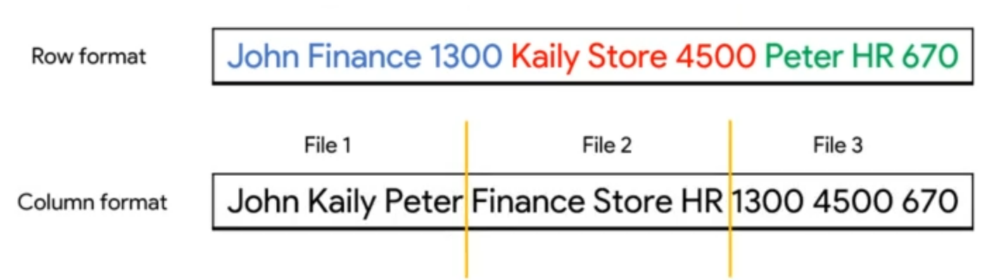

# Architecture
## Engine: *Dremel* 
Combination of columnar data layouts and tree architecture

## File System: *Colossus* 
(Google distribuited filesystem)
It uses **columnar storage** and compression systems.

The *columnar format* is called "capacitor"
### Column vs Row format

**Row:** columns are <u>tied</u> to each other and can't be separated.
**Column**: columns are in separated files that can be in separate disks.

In *Row format*, even if we selected <u>some columns</u>, the **full table scan** will be done.
In *column format* not. It can save time and can be parallelized.

## Usual columnar formats vs BigQuery's capacitor
The difference lies in **how compression is operated**:

**BigQuery** can operate on <u>compressed data</u> without decompressing

## General architecture
