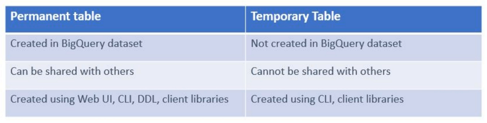

# Create & Query Permanent Table on Cloud Storage bucket

"Create Table"

Create table from: "Google Cloud storage" > Browse the file

**Table Type** 2 options:
- **Native**: directly to bigquery
- **External**: only linked to external

>**Note:** External data doesn't provide table preview and don't get how many bytes will be processed
### Permanent vs temporary tables


### Printing filename where table belongs

```sql
SELECT _FILE_NAME
```