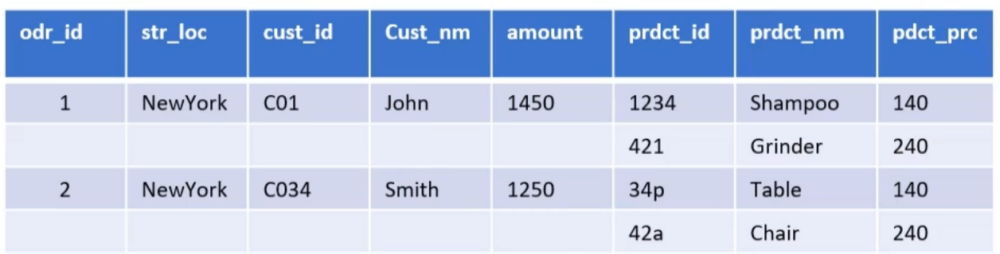
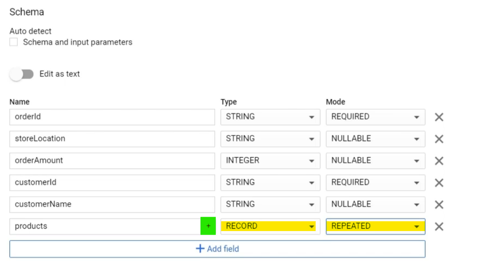

# Designing Efficient Schemas

BigQuery performs better when database is [[Normalization-Denormalization#Denormalization|denormalized]].

But in this case  `GROUP BY` can slow down queries.
Here BigQuery supports columns with **nested and repeated data**.


## Nested & repeated data
Here Data is not duplicated but in one table
Only **<span class="orange">nested</span> columns** are **<span class="purple">repeated</span>**

In BigQuery, **<span class="orange">nested</span> = struct** and **<span class="purple">repeated</span> = array**
-> we will have **array of structs**

So nested and repeated columns can **mantain relationships** without perdormance impact.




Here's the file
```JSON
{
  "orderId": 1,
  "storeLocation": "NY",
  "products": [
    {
      "productId": 1234,
      "productCategory": "Cosmetics",
      "productName": "shampoo",
      "productPrice": 140
    },
    {
      "productId": 421,
      "productCategory": "Kitchen",
      "productName": "grinder",
      "productPrice": 240
    }
  ]
}
```

## Specifying nested fields in schema
You'll need to click "Create table" button

Then set type ==RECORD== and mode ==REPEATED==.
Then a <span class="green">+ (plus)</span> button will appear at the right of the **Name field** 




## How to query the table
You'll need to use `UNNEST`
```SQL
SELECT storeLocation, products 
FROM `bigquery-demo-285417.dataset1.kiopl` 
CROSS JOIN UNNEST(products) as a
where a.productName = "Grinder"
```
