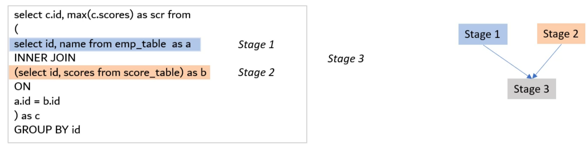

# Query plan execution
What is running under the wood when the query is running?

It breaks declarative SQL statements into granular sets of execution stages and designs an **execution graph**




So will be created an **Execution Plan** to list all the parallel and dependent tasks.

To achieve that level of performance, BigQuery executes queries **completely in memory**.

[BigQuery’s execution engine](https://cloud.google.com/blog/big-data/2016/01/bigquery-under-the-hood) builds simple and purely in-memory operators and achieves petabyte-scale analytics through scalable data repartitioning, or "shuffle."

## Shuffle
Is a key ingredient in any distributed data processing system.

The shuffle step is required for execution of **large and complex joins**, **aggregations** and **analytic operations**.

> ***Note:*** The shuffle step is notoriously slow

n-memory BigQuery shuffle stores intermediate data produced from various stages of query processing in a set of nodes that are dedicated to hosting remote memory.

### Data partitioning
The data repartitioning abstraction defined by BigQuery shuffle consists of three entities: 
1. **producer** creates data to be repartitioned, 
2. **consumer** receives the repartitioned data
3. **controller** process manages the shuffle. 

Shuffle defines the following high-level operations:

```
Producer (producer_id) {  
  void SendRow(row, consumer_id) : Called to send a row to a given consumer  
                                   on behalf of this producer.
}

Consumer (consumer_id) {  
  string ReceiveRow() : Called to receive one row for this consumer.
}

Controller {  
  StartShuffle() : Called before any producers or consumers start sending or 
                   receiving rows.   
  EndShuffle()   : Called after all producers and consumers have successfully                   
                   sent and received all rows. 
}

```

[More](https://cloud.google.com/blog/products/bigquery/in-memory-query-execution-in-google-bigquery)
