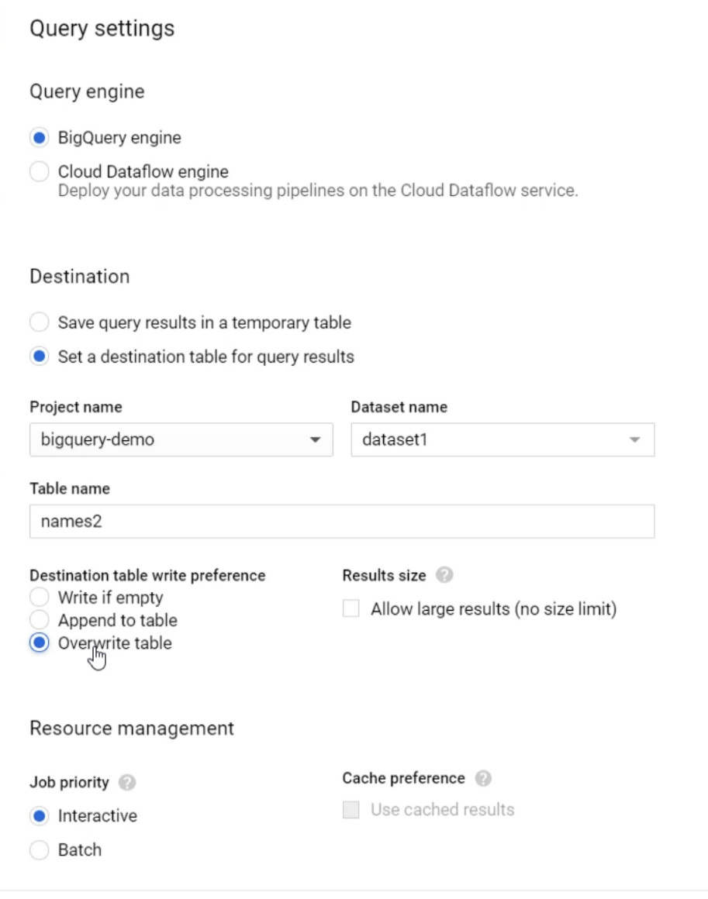

# Manual operations on Table

## Changing column names
Can be done by writing a query where setting **aliases** for the new columns
```SQL
SELECT * EXCEPT(name_to_change),
	  name_to_change as new_name
FROM table_name
```

Then select **query settings**



## Changing datatype
By using a query where we cast the desired column to the desired data type.

***NB:*** Some types can't be directly casted

```SQL
SELECT * EXCEPT(col_to_change),
	  CAST(col_to_change as TYPE) as col_to_change
FROM table_name
```

Then use the same  **query settings** as [[#Changing column names]].

## Deleting column

```SQL
SELECT * EXCEPT(col_to_remove),
FROM table_name
```
Then use the same  **query settings** as [[#Changing column names]].

---
## Changing column mode
Using cloud storage to save the old table and creating a new one, then restoring.

---
## Getting old table values 
You can get a table value from the last **7 days**.

Here's an example:
```SQL
select * 
FROM table_name FOR SYSTEM_TIME AS OF TIMESTAMP_SUB(CURRENT_TIMESTAMP(), INTERVAL 1 HOUR)
```

then, by "query settings" you can save it wherever you want.