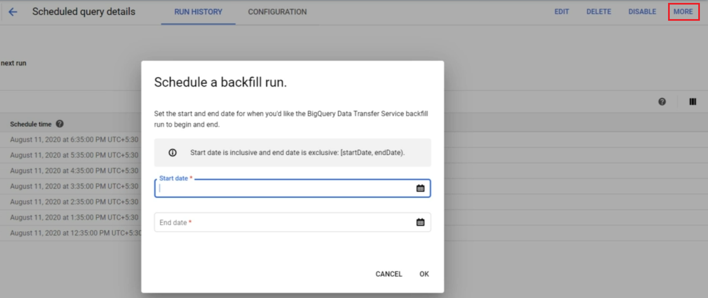

# Scheduled Queries

## Backfilling Mechanism
Running the queries for **previous dates** which the scheduled queries run may have got missed.

### Example
Suppose having:
- a *source table* that is refreshed daily
- a *scheduled query* that runs every day that looks out the *source table* and <u>based on the current date</u> loads it to *another table*

If some day, *source table* is corrupted and <u>not populated</u> for the last 3 days.
Suppose you have **restored the last 3 days** on *source table*.

Is last three days data in the *another table* gone? **No**

**Backfill** allows us to run the query within a <u>pecified date range</u>

### Hou to use Backfill
 Go to BigQuery > Scheduled queries > More *(on top right of the page)* > Schedule backfill. (see image)

Here:
- **start date** is inclusive
- **end date** is exclusive

>***Note:*** here the dates must be in UTC, but *queries schedules in dashboard* are in local timezone

 

 