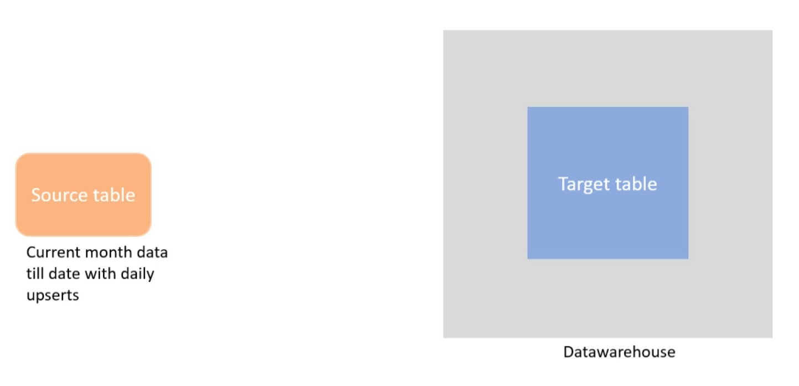
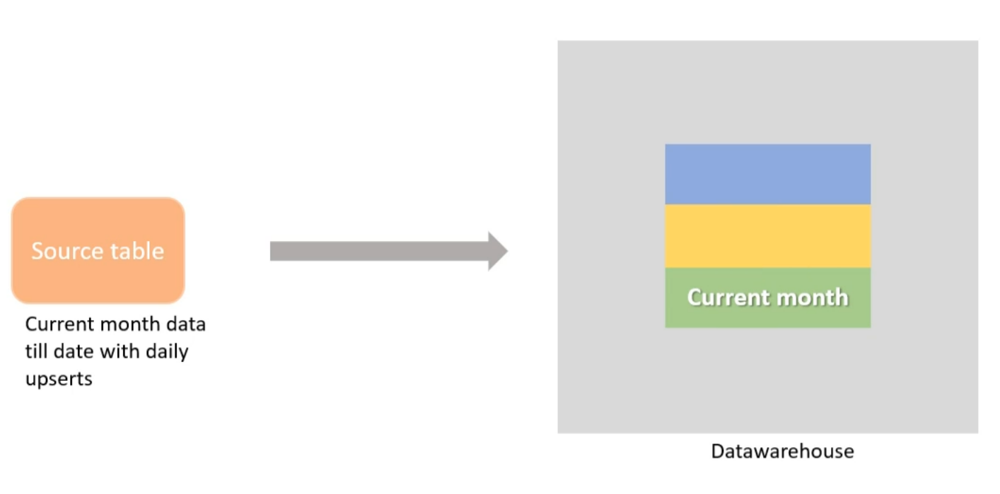

# Table partitioning
**Breaking the table logically** into smaller segments **based on some criteria**, *i.e. the column which we know is going to get used very frequently in where clause.*

Partitioning makes the table easy to manage, performance is enhanced.

## Advantages
- Improves query performance and is cost-effective
- Increases parallelism
- Independent partitions can be managed indipendently
- Different partitions can live on different filesystems: *less frequently accessed data can be placed on slower disks*
- Useful while doing upserts on bulk table (for daily incremental loads in datawarehouse)

 ## Bulk data example
 We have a huge **target table** in the datawarehouse. It's not partitioned.

 The **source table** is some transactional database containing monthly data and gets refreshed daily with <u>increments</u>.

 

 ### Solution
 Partitioning target table on month. And daily **switching the partition with a new one** 
 from source table.

 This takes less time
 

## Creating partitioned table
 When creating a table,
in **Partition and cluster settings**, choose between:
- partition by ingestion time (example [[Ingestion time partition tables]])
- or partition by field (example [[Field partition]])

###  Require partitioning filter (optional)
Users are mandate to include a WHERE clause on the partitioning column qhile they query the table.

This implies that user is forced to take full use of partitioning while the table is partitioned.
It may **reduce cost** and **improve performances**

## Copy and paste

## DML ops
Same as normal but adding a **fltering on the partition**