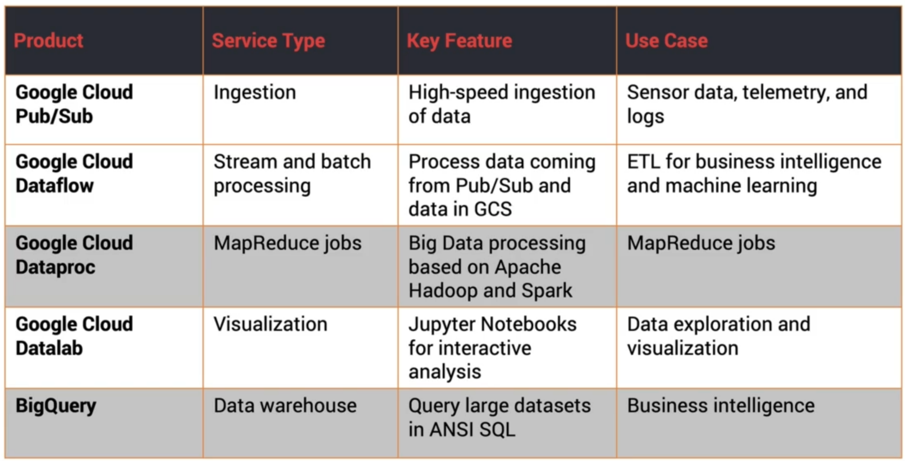

# Data Analytics Services
Uses [[Cloud Pub Sub]] for ingesting data at scale

[[Cloud Dataflow]] processes data in real-time or batch

[[Cloud Dataproc]] is a Big Data service for Hadoop and Spark jobs

[[Cloud Datalab]] is for analyzing and visualizing data

[[Big Query]]

## Use Cases
