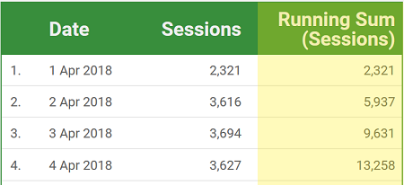

# DataStudio

# Tables

### Data> Optional metrics
Adding other metrics hidden by default.
You can select/deselect them by clicking on the bar icon at the top right of the table.

### Data > Interactions > Apply filter
When clicking a row in the table, a filter will be applied to all the data

### Conditional Formatting (Style > Metrics)
- Heat map
- Bar pub/sub
- conditiona formatting (custom)

---
# Comparison Calculations

Data > Metric > \<selected metrics\> > Edit > Comparison Calculation

Some optons:
- Percent of total
- Difference from total
- Percent difference from total: how much data is different from the total in %
- Percentage of max: how much data is different from the highest value in its range in %
- Difference from max
- Percentage difference from max

# Running Calculations
Data > Metric > \<selected metrics\> > Edit > Running Calculation

Also called "Running summaries"

## Running sum 
Each new row is added to the sum of the previous row(s).

# Creating custom calculation fields
Resources > Manage added resources > \<row of the desired source\> > edit > Add field

You need to add a *field name* and write the formula using existent fields.

**Case statement** can also be used

### Comparison Date Range
Data > Comparison Date Range

# Extract data
Data Source > Extract Data
**Improves the performance** of reports and explorations by extracting data from your data set creating a **brand new table**.

Can use existing data sources of any type, then select the specific fields you want to include in the extracted data source.

Can set an **Auto-Update**

>Extracting data from an **already aggregated** data set, such as Google Ads or Analytics, creates a new, disaggregated data set.

# Charts
## Drill Down
A way to reveal additional levels of detail within a chart by clicking on arrows on the top of the tables.

ex. time series in the order of years, can be drilled down into months