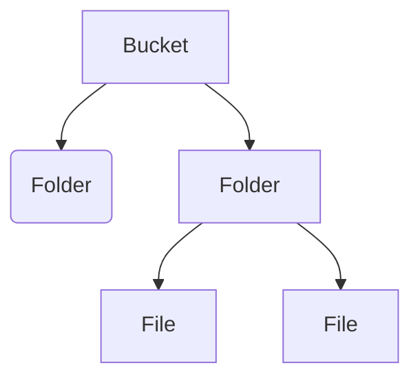

# Storage & Database Services
## Storage Services
- Unified object storage for a variety of applications  
• Applications can store and retrieve objects through single API  
• GCS can scale to exabytes of data   
• Data can be stored within a single region, dual-region, or multi-region

### Persistent disks
- Independent (out of the context) from compute engine VMs
- Only one writer, multiple readers
- Can be replicated in **regional** or **local**
### Cloud Filestore
- **Managed**
- For **legacy** apps
- Shared & NAS-like filesystem
- for GCE e GKE
- Useful for [[on-premises]] applications
- Zonal storage for **replications**
- encrypted

![[database_services]]