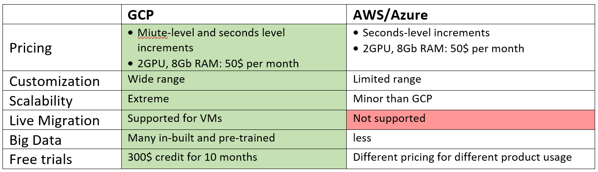

# Google Cloud Platform
## GCP vs others

## Network
GCP is divided in **regions** -> **zones** -> **network edge locations** 
## The Big picture

## Resources
When launching, it results a creation of [[Resource]]s
## Projects
[[Project]] is a critical, **billable unit** with credit associated.

## Interacting with GCP
Can be done via:
- Web Console
- Cloud Shell / Cloud SDK
- Mobile App
- CLI (DevOps)
- [[REST]] API

## [[Compute Services]]

## [[Storage & Database Services]]

## [[Network Services]]

# Security & Identity Services
[[Identity & Access Management]]

[[database_services]]

[[Data Analytics Services]]

[[AI & ML Services]]

[[DevOps Services]]