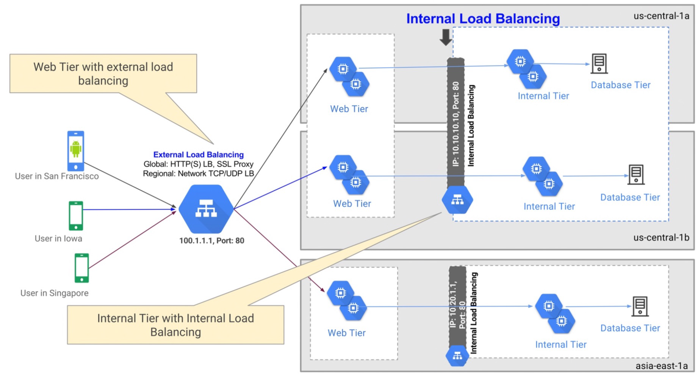

# Network Services
Relies on Google's global network.

- Has load balancers
- is a Virtual Prvate Cloud

## Load balancing
Can route requests also across the globe

2 types:
- **HTTPS**: Global load balancing
- **Network**: endpoints of the same <u>region</u>

Both can be internal or external for *scalability*

## Virtual Prvate Cloud
Software-defined network providing private networking for VMs.

It is useful for **sensitive sources**

To enable private networking (=an isolated space) within the public cloud and deploy applications/resources in that zone.

Isolates VMs running inside the VPCs

- Is a <u>global resource</u> visible from any region
- Each one is <u>logically</u> isolated from the others
- Traffic within networs can be restricted via firewall
- Has private DNS
- Multiple VPCs can be connected trough **peering**

## Hybrid Connectivity
Extending local datacenter **steamlessly** to GCP infrastructure

3 services:
- **Cloud interconnect**: Extends on-premises network via dedicated (*Google*) or parthner interconnect.
- **Cloud VPN**: for basic secure connectivity
- **Peering**: Direct access to Google Cloud resources with reduced internet edges fee

